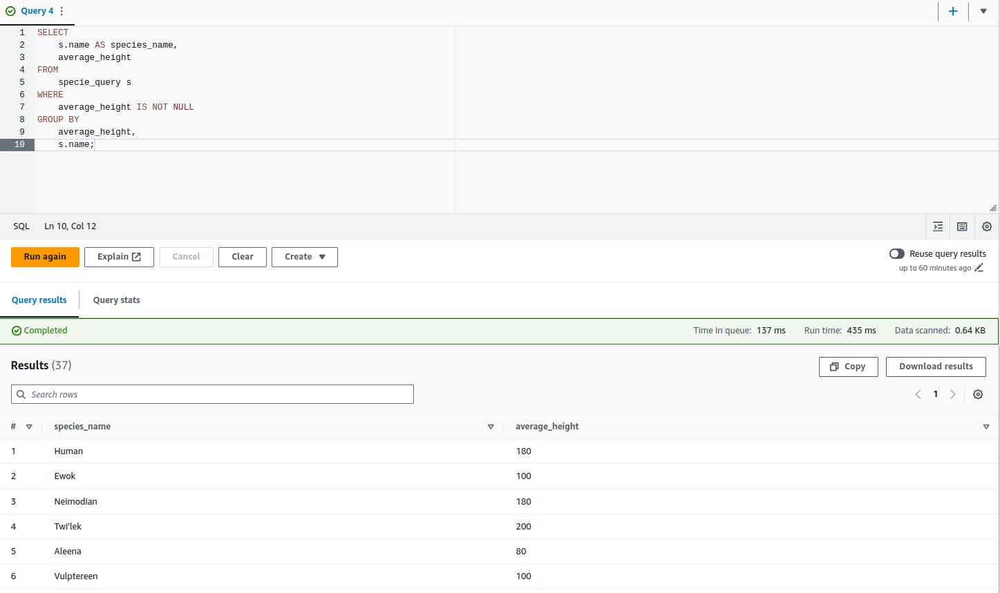
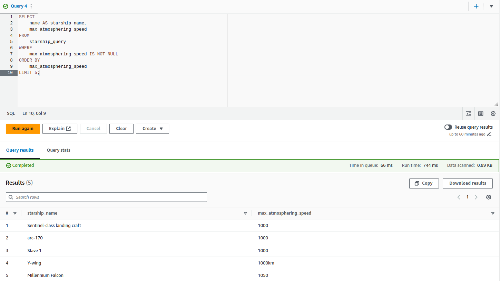
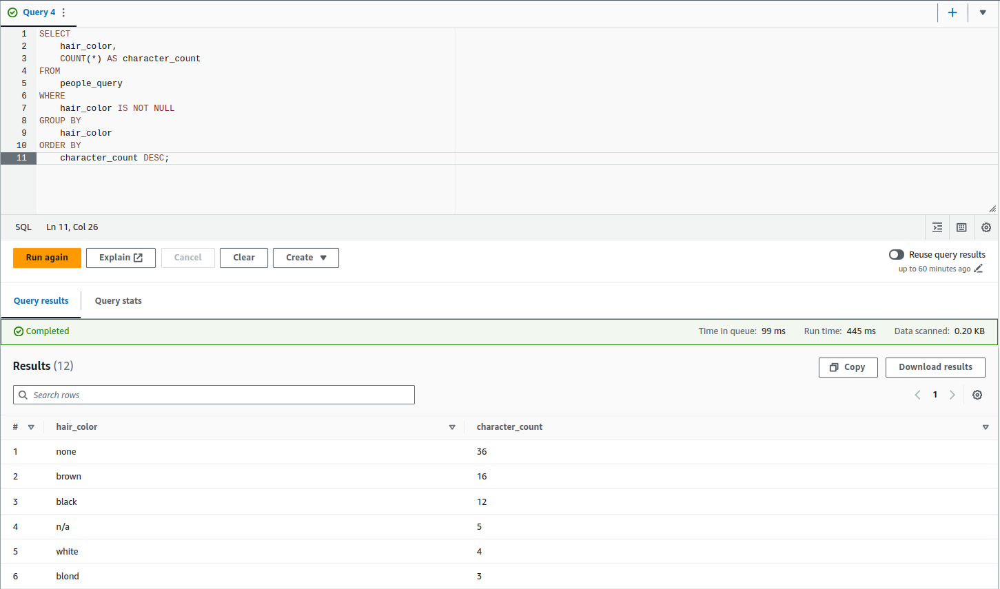

# SQL Insights Documentation

## Overview
This sub-folder contains SQL files that capture various insights derived from the Star Wars universe database schema. Each SQL file represents a specific analysis or query result aimed at providing a deeper understanding and exploration of the Star Wars universe.

**Note:** The queries were executed using Athena.

Average height:

Fastest ships:

Most commum hair collor:

